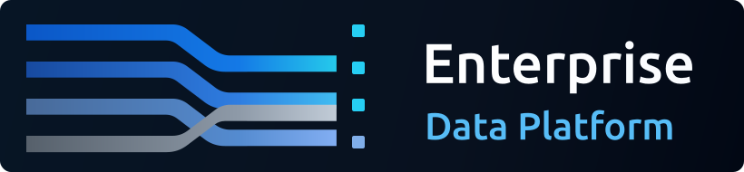

# Enterprise Data Platform

<p>
  
</p>

Canonical version: see `VERSION`.

Public website: https://edp.mcguire.technology/

Brand assets and usage guidance: https://edp.mcguire.technology/branding

Enterprise Data Platform is a collection of tools and data processing patterns for collecting cross-system operational data, landing it in a raw data store, normalizing and enriching it into an Operational Data Store, historizing it in a Data Vault, and publishing focused Data Marts for reporting and application use.

Requirements

- Python 3.8 or higher
- Node.js 14 or higher

Documentation Development

```sh
npm install
npm run docs:dev
```

Local PostgreSQL Development

This repo includes a Docker Compose PostgreSQL instance and Alembic migrations
for multiple databases and schemas. The local PostgreSQL image includes
pgBackRest for physical backups and WAL archiving.

```sh
python -m venv .venv
source .venv/bin/activate
pip install -r requirements.txt
cp .env.example .env
make postgres-up
make db-upgrade
make pgbackrest-stanza
make pgbackrest-backup
```

Local dbt Development

```sh
make dbt-debug
make dbt-run
make dbt-test
```

dbt runs through the Compose `dbt` tooling container. The default target is
`mart`, which writes to `edp_mart`; set `DBT_TARGET=ods`, `vault`, or `raw`
for other local targets.

Local Great Expectations Development

```sh
make gx-version
make gx-cli
```

Great Expectations, also called GX Core, runs through the Compose `gx` tooling
container. Use it for reusable data quality suites and validation results
against raw, ODS, vault, and mart outputs.

Local OPA Development

```sh
make opa-up
make opa-test
make opa-eval-asbr
```

OPA is available at `http://127.0.0.1:8181`. Use it to prototype policy-as-code
decisions for CKAN publication, third-party exports, dataset access, and other
governance gates.

Local MinIO Development

```sh
make minio-up
make minio-ls
```

MinIO is available at `http://127.0.0.1:9001` for the console and
`http://127.0.0.1:9000` for the S3-compatible API. Use it locally for raw file
landing, archive objects, exports, CKAN resources, and backup repositories. It
is the local object-storage adapter and can be migrated later to S3, Azure
Blob/ADLS, Google Cloud Storage, Ceph, or another compatible object store.

Local OpenBao Development

```sh
make openbao-up
make openbao-init
make openbao-status
```

OpenBao is available at `http://127.0.0.1:8200`. The local Compose service runs
in dev mode with `OPENBAO_DEV_ROOT_TOKEN_ID` from `.env.example`; use it for
local secret-management integration tests, not production storage.

Local Airflow Development

```sh
make airflow-up
```

Airflow is available at `http://127.0.0.1:8080` with the local default admin
credentials from `.env.example`. DAGs live under `airflow/dags`.

Local Superset Development

```sh
make superset-up
```

Superset is available at `http://127.0.0.1:8088` with the local default admin
credentials from `.env.example`. Use the `edp_mart` database for initial
dashboard development.

Local OpenMetadata Development

```sh
make openmetadata-up
```

OpenMetadata is available at `http://127.0.0.1:8585` with the local default
basic-auth administrator credentials `admin@open-metadata.org` / `admin`. Its
embedded ingestion service runs on host port `8081` to avoid colliding with
the EDP Airflow UI on port `8080`.

Local CKAN Development

```sh
make ckan-up
```

CKAN is available at `http://127.0.0.1:5000` with the local default sysadmin
credentials from `.env.example`. Use CKAN for public dataset publication,
ASBR-style reporting packages, downloadable resources, and transparency pages
that explain which data is shared with third parties and for what purpose.

Data Ops Stack Summary

| Tool | Function |
| --- | --- |
| PostgreSQL | Primary local persistence for raw, ODS, Data Vault, Data Mart, app, and component metadata databases. |
| PgBouncer | Connection pooling layer used by local services and database clients inside Compose. |
| PgAdmin | Browser-based PostgreSQL administration for local inspection and troubleshooting. |
| pgBackRest | Physical PostgreSQL backups, WAL archiving, backup metadata, and restore support. |
| Alembic and SQLAlchemy | Versioned database schema modeling and migrations for EDP-owned databases. |
| dbt | SQL transformation models, tests, documentation, and lineage for ODS, Vault, and Mart layers. |
| Great Expectations | Reusable data quality expectation suites, validation results, and quality documentation. |
| Open Policy Agent | Policy-as-code decision engine for dataset access, publication, export, and compliance gates. |
| OpenBao | Local secrets manager for API tokens, passwords, certificates, service credentials, and rotation patterns. |
| MinIO | Local S3-compatible object storage for raw files, archives, exports, CKAN resources, and backup repositories. |
| Apache Airflow | Pipeline orchestration for scheduled ingestion, transformation, checks, and operational workflows. |
| OpenMetadata | Catalog, discovery, ownership, glossary, metadata ingestion, and lineage hub for governed data assets. |
| Elasticsearch | Search index backing OpenMetadata catalog discovery. |
| CKAN | Public data portal for published datasets, statutory reports, transparency resources, and third-party data-flow disclosures. |
| Solr and Redis | CKAN search and cache/job support services. |
| CKAN DataPusher | Loads tabular uploaded resources into CKAN DataStore for preview and API access. |
| Apache Superset | BI, dashboarding, and semantic-layer experiments against governed ODS and Data Mart outputs. |
| VitePress | Documentation site for architecture, runbooks, source systems, and operating guidance. |

The local container creates:

- EDP-owned data and application databases: `edp_raw`, `edp_ods`, `edp_vault`, `edp_mart`, and `edp_app`.
- Component metadata databases: `airflow`, `superset`, `openmetadata`, `openmetadata_airflow`, `ckan`, and `ckan_datastore`.

Postgres bootstrap settings and local database URLs are documented in
`.env.example`. PostgreSQL runs in Docker Compose behind PgBouncer. Database
clients in this repo should use the internal service name `pgbouncer`; direct
host port exposure is available only through the explicit `db-port` profile.

Docker Compose uses `POSTGRES_USER`, `POSTGRES_PASSWORD`, and `POSTGRES_DB`;
the database init script uses `POSTGRES_USER` as the owner for EDP-owned
databases and creates separate owners for the `airflow`, `superset`, and OpenMetadata
metadata databases.

Use Alembic for database DDL that needs repeatable promotion between
environments. The `airflow` and `superset` databases are intentionally not
managed by these migrations because those applications manage their own
metadata schemas. Use dbt for transformation models, tests, documentation, and
lineage once data is landing in PostgreSQL.

The SQLAlchemy modeling layer lives in `postgres/models/`. Update those
models first, then create migrations with:

```sh
alembic -c postgres/alembic.ini -n <database> revision --autogenerate -m "describe change"
```

Verify drift with `make db-check`. OpenMetadata follows its own application
migration process through `make openmetadata-migrate`.
