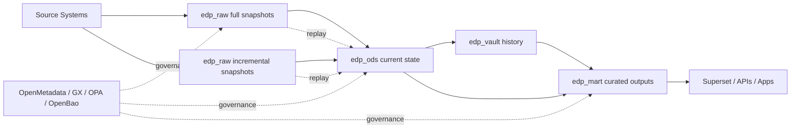

# Data Workflow

This page defines the standard EDP flow across raw, ODS, Data Vault, and mart databases, with emphasis on lineage and safe reprocessing.

## Goals

- Capture source records in raw form before applying business logic.
- Support full snapshots and incremental snapshots where source systems allow it.
- Preserve enough raw history to rebuild downstream layers after connector or transform fixes.
- Keep ODS, vault, and mart processing deterministic and re-runnable by bounded windows.

## From Data Lake to Business Value

The simplest EDP mental model is: raw data in, trusted insight out.

| Layer | Plain-English Role | EDP Implementation |
| --- | --- | --- |
| Data sources | Operational systems, databases, APIs, files, logs, SaaS apps, and third-party services | Connector packages and Airflow DAGs |
| Data lake / landing zone | Store source data as-is so it can be replayed, audited, and reprocessed | `edp_raw` source schemas plus MinIO buckets for large files, archives, and extracts |
| Data warehouse | Clean, conform, integrate, and preserve current and historical business state | `edp_ods` for current operational state and `edp_vault` for durable history |
| Data marts | Curate focused datasets for business questions and user-facing products | `edp_mart` reporting tables, semantic views, dbt models, and GX validations |
| Consumption | Dashboards, reports, public datasets, applications, alerts, and exports | Superset, CKAN, APIs, custom apps, and downstream integrations |

Raw data management runs across the flow: ingestion, metadata, cataloging, lineage, and quality checks should be captured from the first landing step instead of added later as cleanup work. Use Great Expectations where validation evidence needs to be reusable, reviewable, and orchestrated across layers.

Governance, security, and observability are the guardrails around every layer. EDP should make ownership, lineage, quality, access control, audit logs, monitoring, policies, secrets handling, and compliance visible enough that people can trust the outputs. Use OPA where governance rules need to become executable allow or deny decisions for publication, access, exports, or deployment checks. Use OpenBao where services need to retrieve credentials from a controlled secret store instead of reading long-lived secrets from local files.

For public schools, the consumption layer includes public transparency obligations as well as internal dashboards. CKAN should publish approved artifacts such as ASBR packages, public reporting datasets, and plain-language disclosures about which data is shared with third parties and why.

## Database Responsibilities

| Database | Responsibility |
| --- | --- |
| `edp_raw` | Immutable landed payloads, source-shaped snapshot tables, ingestion metadata, and replay anchors |
| `edp_ods` | Current and near-current source-conformed operational state |
| `edp_vault` | Historized hubs, links, satellites, source lineage, and change history |
| `edp_mart` | Curated reporting tables, semantic views, and dashboard-facing outputs |
| `edp_app` | Workflow and application state that does not belong to upstream source systems |

## End-to-End Flow

## Raw Layer Standards

Raw records should include:

- Source system or tenant key
- Source entity or endpoint
- Source object key or natural key fields
- Snapshot mode, such as `full` or `incremental`
- Snapshot timestamp or extraction window
- Ingestion timestamp
- Run identifier
- Optional payload hash for dedupe and change detection

Full snapshots capture complete source state at a point in time. Incremental snapshots capture deltas using a cursor such as `whenChanged`, Graph delta links, `updated_at`, or another source-supported change indicator.

## Processing Pattern

Raw to ODS processing should use idempotent upserts and deterministic merge rules. Late-arriving records and connector fixes should be handled by replaying affected raw windows instead of patching downstream tables by hand.

ODS to vault processing should preserve history explicitly. Vault to mart processing should publish stable tables and views for dashboards, APIs, and operational applications.

## Reprocessing Controls

Reprocessing should be bounded by `snapshot_ts`, `sync_run_id`, source key, or date range.

Run downstream steps in order:

1. `edp_raw` to `edp_ods`
2. `edp_ods` to `edp_vault`
3. `edp_vault` or governed ODS views to `edp_mart`

Prefer replacing affected partitions, windows, or source slices over row-by-row correction. Preserve prior run metadata so reprocessing remains auditable.

## Current Connector Alignment

AD and M365 DAGs land source-shaped tables under `edp_raw.ad` and `edp_raw.m365`. M365 processing also merges into `edp_ods.m365` for current user, group, Teams, channel, and membership state.

Keep connector code and transform code versioned separately. Connector DAGs should land source data and run metadata; dbt or purpose-built processing DAGs should own cross-layer transformations.
